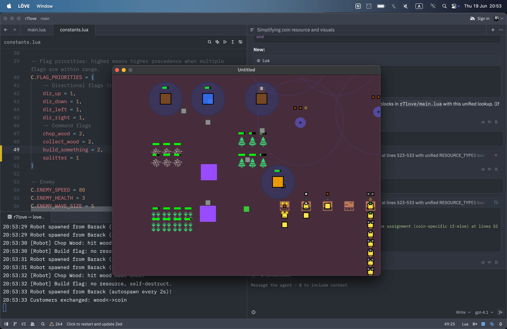

# Generating Game Prototypes from Game Design Document with LLMs

This repository contains a generated prototyping sandbox described in the article in the Luden.io's blog [Generating prototypes from game design document with Cursor, Zed and LÖVE](https://blog.luden.io/generating-prototypes-from-game-design-document-with-cursor-zed-and-l%C3%B6ve-7b8d932194d7).

For tile textures, we used free assets by [Kenney.nl](https://kenney.nl/) (licensed CC0): https://kenney.nl/assets/micro-roguelike
